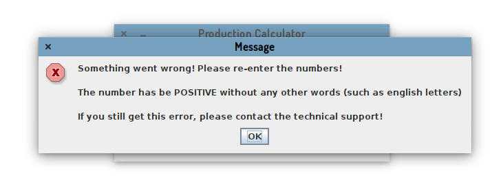

# Java Programming - Assignment

This is a part of Java Programming Assignment 1 (The Documentation)

## Assignment Details

- Name: Xuanao Zhao
- Intake: 2020 March
- Program: Diploma In Information Technology
- Assignment: Assignment 1
- Question:  Question 1

## Content

#### Program Description

This program is to calculate Cartons, Cost and Profit from inputted Milk Production in Liters

#### Design (Flowchart or UML diagram)

#### How To Use (Expected Inputs  and Outputs, Steps)

> Do calculation

When you first load up, you can see a window showing you the instructions, an input field and a button says "Cauculate".

Enter some milk amount in liters to the input field

Press calculate, a new window will show you the calculation result

Press OK to close the result window.

> Error handling

If you enter something other then valid numbers such as English Text or Negative Number, an error will be shown

Press OK to close the error window.

> Exit from program

Press the X button on the top bar will exit the application. 

