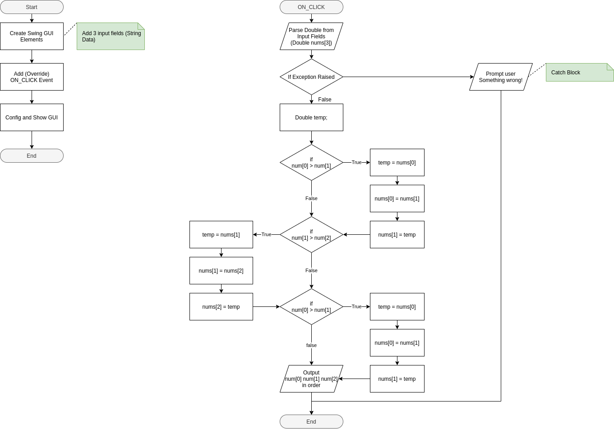
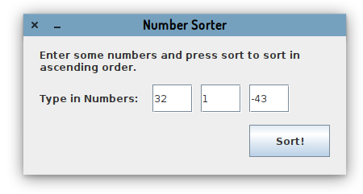
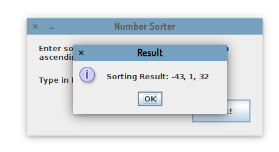
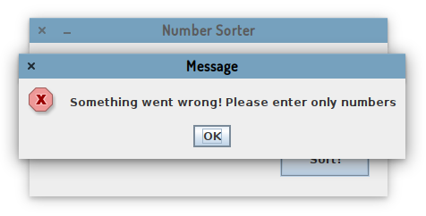
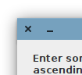

# Java Programming - Assignment

This is a part of Java Programming Assignment 1 (The Documentation)

## Assignment Details

- Name: Xuanao Zhao
- Intake: 2020 March
- Program: Diploma In Information Technology
- Assignment: Assignment 1
- Question:  Question 2

## Content

#### Program Description

This program will sort the 3 numbers which you input and sort them in ascending order

#### Design (Flowchart or UML diagram)

#### How To Use (Expected Inputs  and Outputs, Steps)

> To Begin Sorting

When you start this program, you will be able to see the a window with an instruction, 3 input fields and a button says "Sort!".

Enter some number to the input field.

Then press "Sort!" will show you the result.

Press OK to close the result window.

> Error handling

If you enter something other then numbers on **ANY** of the 3 input fields, you will get an error message.

Press OK to close the error message window

> Exit program

Press the X button on the top will exit from the application

