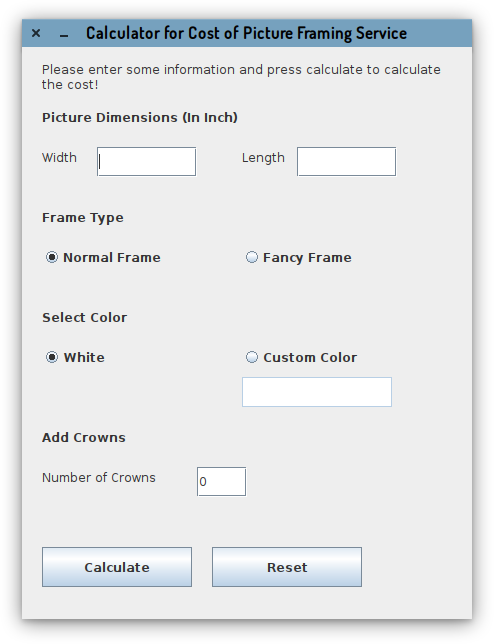
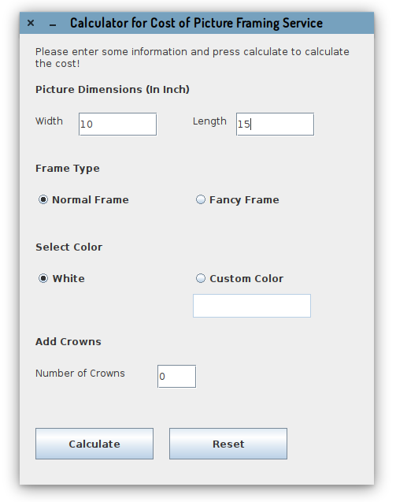
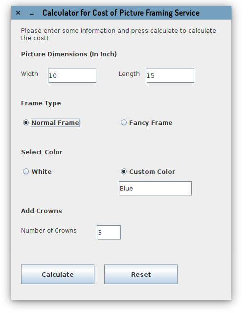
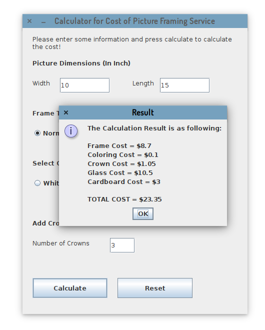
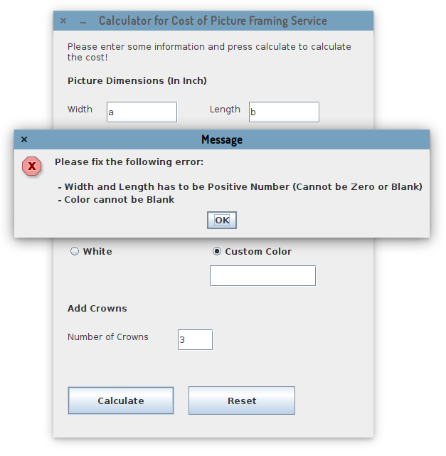
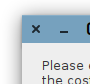

# Java Programming - Assignment

This is a part of Java Programming Assignment 1 (The Documentation)

## Assignment Details

- Name: Xuanao Zhao
- Intake: 2020 March
- Program: Diploma In Information Technology
- Assignment: Assignment 1
- Question:  Question 2

## Content

#### Program Description

To calculate the cost of framing a picture from inputted informations

#### Design (Flowchart or UML diagram)

#### How To Use (Expected Inputs  and Outputs, Steps)

> To Begin Sorting

When you start up this program, you will see instructions, input fields, and radio buttons.

To start calculate, you **must** enter a width and a length in inch.

Then select the Frame Type, Color and Number of Crowns to add.

Please note if you select Custom Color, you will need to enter the color you wish to paint

After everything is entered and selected, press Calculate to calculate the price. A window will show up for the result.

Cost for each component is calculated, and a total price will be summed at the bottom of the window

> Error handling

If input fields are invalid, an error message will be displayed, while the reason(s) are being showed in the message

Press OK to close the error message window.

> Reset all fields

Press the Reset Button can reset all the input fields into the initial status.

> Exit program

Press the X button on the top will exit from the application

