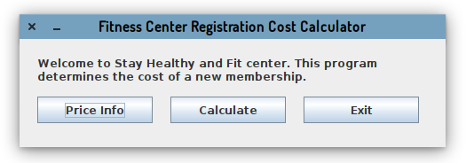
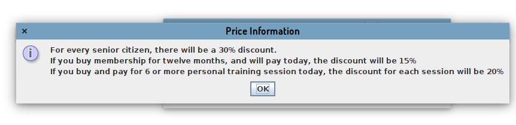
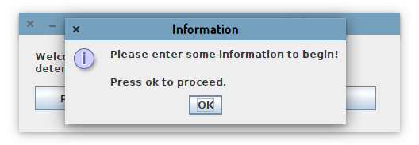
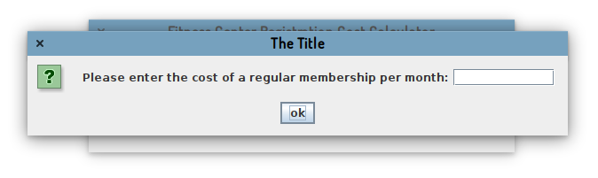
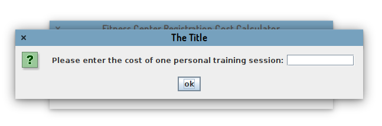
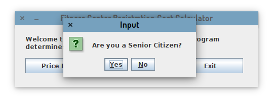
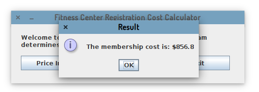
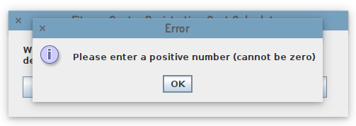
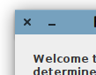
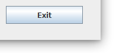

# Java Programming - Assignment

This is a part of Java Programming Assignment 1 (The Documentation)

## Assignment Details

- Name: Xuanao Zhao
- Intake: 2020 March
- Program: Diploma In Information Technology
- Assignment: Assignment 1
- Question:  Question 2

## Content

#### Program Description

To calculate membership cost of Fitness Center.

#### Design (Flowchart or UML)

#### How To Use (Expected Inputs  and Outputs, Steps)

> Start Using

After start up the program, you will be able to see a menu with 3 options.

> To show price Info

Press on the Price Info of the button to show the price info. A windows will be shown.

> To Calculate the cost

Press Calculate to begin the calculation process.

You will be asked for informations that will be used to calculate your cost.

Press OK to proceed.

Enter the information according to the prompt text.

Sometimes it will ask you a "Yes No Question". Select Yes or No for these cases

After Everything is being entered, the result will be shown

> Error handling

If you have entered any invalid text, you will be prompted with an Error message

For example:

> Exit the program

To exit the program, press the Exit button or the X button on the top

   

