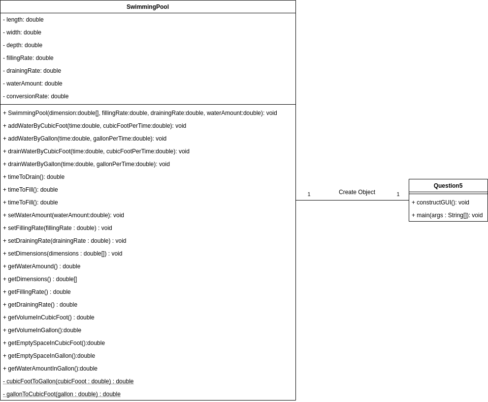
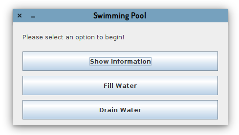
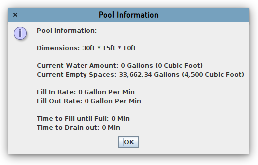
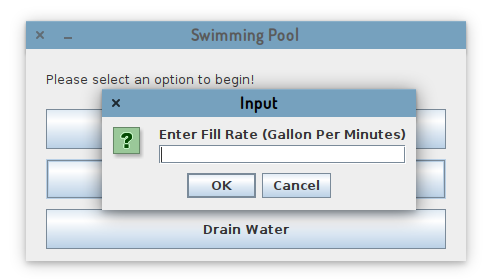
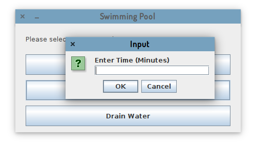
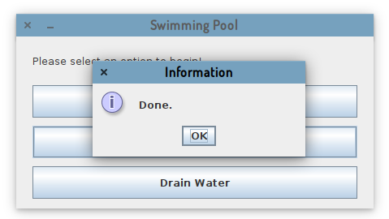
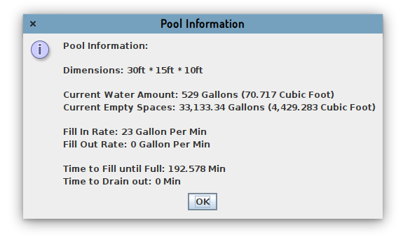
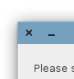

# Java Programming - Assignment

This is a part of Java Programming Assignment 1 (The Documentation)

## Assignment Details

- Name: Xuanao Zhao
- Intake: 2020 March
- Program: Diploma In Information Technology
- Assignment: Assignment 1
- Question:  Question 2

## Content

#### Program Description

To emulate a water pool (30ft * 15ft * 10ft) with different operations (fill water, drain water and view pool information)

#### Design (Flowchart or UML)

#### How To Use (Expected Inputs  and Outputs, Steps)

> The main menu

Once you start up your program, you will be able to see a menu.

> To view the information of the Pool

Press Show Information, you will be able to see the dimensions, Water amount, time calculations.

When Fill in rate and Fill out rate is not being initialized (is 0), the time calculation will also be 0.

Press OK to close this window.

> To Fill in or drain out water

Press Fill Water or Drain Water Button, you will be able to input your water filling rate

Input some number and press OK to proceed to enter Time

Input some number and press OK

Press OK to exit from this window. Now if you view the pool information, numbers should be updated.

> To exit the program

Press the X button to exit from the application

